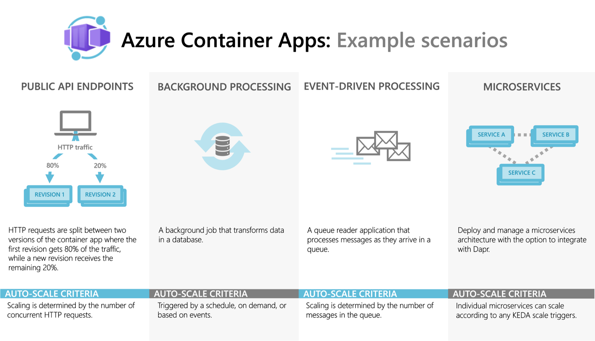

 
<!-- 
_class: lead 
-->

# Azure Container Apps

---
## Was sind Container Apps
* serverlose Plattform für containerisierte Apps
* man könnte sagen: Kubernetes as a Service

---
## Mögliche Szenarien
* Bereitstellen von API's & Anwendungen
* Hosten Services zur Hintergrundverarbeitung
* ereignisgesteuerte Verarbeitung
* Ausführen von Microservices

---
## Features
* HTTPS/TCP Eingänge in Container
* Ausführung bei Bedarf (Zeitgesteuert/Ereignisse)
* Container aus beliebigen Registries
* Verwaltung von Secrets direkt an der Umgebung
* automatiserbare Verwaltung (z.B. CLI, ARM, BICEP)

---
## Dynamische Skalierung
* Container können auf 0 skaliert werden
* HTTP-Datenverkehr
* Ereignisgesteuerte Verarbeitung
* CPU- oder Arbeitsspeicherauslastung