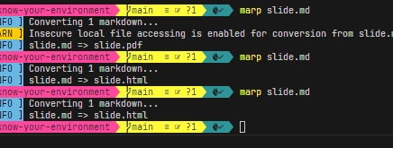

# Know your Environment 
Don‘t become a slave of your IDE

---
<!-- _backgroundColor: #00f -->
<!-- header: Know your Environment -->



## Features in VS2022

* Pin tabs
* Colored tabs

```csharp
class myClass(){
  who hüfuüweh fhweühf wehf üwehf hweühf üwehfuh wefhuwefüuh weühfüwuehf hweuhfüwqhef hwefhüweuhf hwefuüh üwehfüuh weufhweüfh weuhf ühweühf whefühweüuhf h
}
```

---

# Wide Scrollbar

---

# Intellisense 
* References => method, prop, class
* Shorts => ctor, prop
* Analyzer hints 
* Git hints

$$ f(x) = 1x + 2 $$

---

# Extensions
* Solution coloring
* Error visualization 
* Productivity PowerTools
* Mark Selection in Bar
* Colored build output

---

# Shortcuts
* Strg K C, Strg K U
* Breakpoints
* Format Document 
* F12 => To Definition

---

# Windows
* OUTPUT
* WATCH
* STACKTRACE
* ObjectBrowser
* Intermediate Window

---
# Debugging
* Change vals
* Locals view