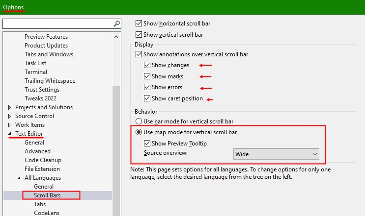

 
<!-- 
_class: lead 
-->

# Know your Environment 
Don‘t become a slave of your IDE

---
<!-- 
header: Know your Environment
_class: lead
-->

## Features in VS2022

---
<!-- 
_paginate: hold 
_header: Know your Environment - Features in VS2022 
_footer: Einleitung | **Features** | Extensions | Texteditor
-->
### Dokumente/Tabs 

* Dokumente können in mehreren Reihen angezeigt werden
* Dokumente können gepinnt werden
* Dokumente können farblich gruppiert werden
* Dokumente können in Preview-Tab geöffnet werden

TODO:#addscreenshot

<!--
== mehrreihige Tabs ==
 + Tabs können in mehreren Reihen angezeigt werden
 + Reihen werden automatisch nach Umbruch (wenn Zeile voll) erstellt
-->
<!--
== gepinnte Tabs ==
 + Tabs können angepinned werden
 + Gepinnte Tabs können in einer eigenen Reihe angezeigt werden
 + Pin-Status kann beibehalten werden
-->
<!--
== farblic gruppierte Tabs ==
 + Tabs können farblich gruppiert werden
 + es kann nach Projekt, Extension oder einer RegEx unterschieden werden
 + Farbauswahl erfolgt automatisch, kann aber bei Bedarf angepasst werden
-->
<!--
== Preview Tab ==
  + einmaliges Anklicken öffnet die Preview
  + es ist immer nur ein Dokument in der Preview sichtbar
  + Dokument wir temporär geöffnet und angezeigt
  + Tab ist dabei ganz rechts außen
  + Preview wird zu "richtigem" Tab bei Änderung im Dokument 
    oder Doppelklick 
    oder durch "Keep open" button
-->
<!--
== Wie nutze ich das? ==
  + zur Orientierung und Navigationsunterstützung
  + Mehrzeilige Tabs, um alle Tabs im Blick zu haben, auch wenn es mal mehr sind
  + der aktive Tab ist immer fett gedruckt, damit besser erkennbar
  + ich pinne Dokumente, wenn ich die oft brauche oder oft suchen muss
  + Preview verhindet das unnötige öffnen/schließen, wenn man quasi im Code stöbert
      => z.B. beim Suchergebnisse durchgehen
-->
<!--
== Einstellungen ==
  -> "Show tabs in multiple rows"
  -> "Bold text on selected tabs"
  -> "Colorize document tab by"
  -> "Show pinned tabs in a seperate row"
  -> "Show Pin button on unpinned documents"
  -> "Maintain pin status if document was removed from document welL"
-->
---
<!--
_paginate: hold 
_header: Know your Environment - Features in VS2022 
_footer: Einleitung | **Features** | Extensions | Texteditor
 -->

### Scrollbar

* kann als Navigations und Suchinstrument genutzt werden
* verschiedene Aspekte können in der Scrollleiste angezeigt/geflaggt werden
* es können untershiedliche Breiten eingestellt werden

<!-- 
* können in den Optionen eingeschaltet werden  
* verschiedene Informationen zum aktuellen Dokument können schnell erfasst werden
-->
<!--
== Wie nutze ich das? ==
  + zum erkennen der groben Struktur eines Dokuments
  + zur unterstützung bei der Suche nach Verwendungen, Fehlern innerhalb eines Dokuments
  
-->
---
<!-- 
_class: lead 
-->
## Intellisense/Intellicode

---
<!--
_paginate: hold
_header: Know your Environment - Intellisense/Intellicode
-->
### References 

* References => method, prop, class
* Shorts => ctor, prop
* Analyzer hints 
* Git hints

---

# Extensions
* Solution coloring
* Error visualization 
* Productivity PowerTools
* Mark Selection in Bar
* Colored build output

---

# Shortcuts
* Strg K C, Strg K U
* Breakpoints
* Format Document 
* F12 => To Definition

---

# Windows
* OUTPUT
* WATCH
* STACKTRACE
* ObjectBrowser
* Intermediate Window

---
# Debugging
* Change vals
* Locals view